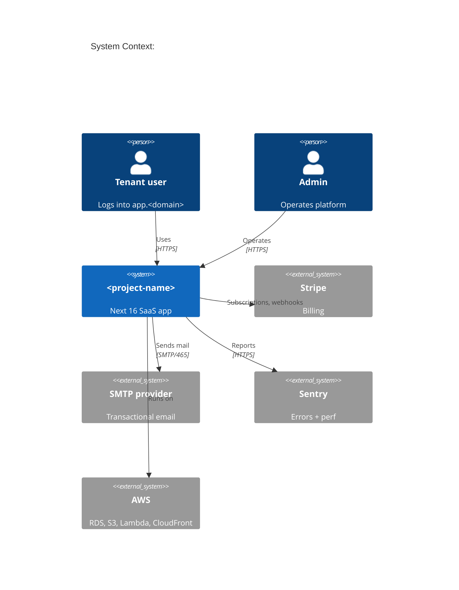

# Architecture

> 1-paragraph entry. Detail lives in `docs/SYSTEM.md`.

Multi-tenant Web SaaS. Single Next 16 app on `app.<domain>` (marketing site lives externally). Better Auth handles identity + organization tenancy; tenant isolation enforced at DB layer via Postgres RLS keyed on `org_id`. Background jobs ride pgmq inside Postgres. Deployed to AWS via SST in `<aws-region>`: Lambda primary with Fargate fallback, RDS Postgres 18 with RDS Proxy, S3 for assets + uploads, CloudFront edge.

## C4 context (Mermaid)

## Boundaries

| Layer | Owns | Imports from |
|---|---|---|
| `src/app/` | Routes, layouts, RSC | `features/*`, `lib/*`, `server/*` |
| `src/features/<x>/` | Business logic for one slice | `lib/*`, `server/*`, `db/schema` |
| `src/server/` | Cross-feature server-only utils | `lib/*` |
| `src/lib/` | Framework-agnostic utils | (leaf) |
| `db/` | Schema, migrations, seed | (leaf) |
| `infra/` | SST stacks | (leaf, deploy-time) |

## Pointers

- [docs/SYSTEM.md](docs/SYSTEM.md): backend/frontend detail, data flow, sequence diagrams
- [docs/DESIGN-SYSTEM.md](docs/DESIGN-SYSTEM.md): color, type, spacing, components
- [docs/DOMAIN.md](docs/DOMAIN.md): glossary, ER diagram, lifecycle states
- [docs/adr/](docs/adr/): accepted architectural decisions
- [docs/conventions/](docs/conventions/): style, naming, patterns
- [infra/README.md](infra/README.md): deploy topology, per-env matrix
