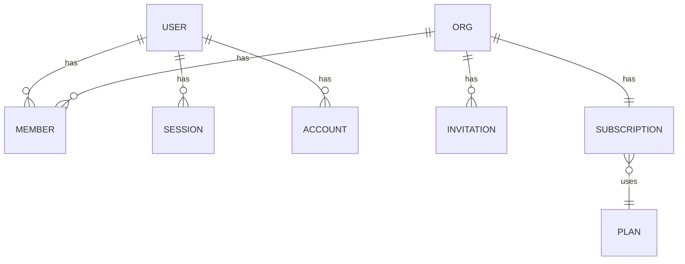

# Domain

> Glossary, entity relationships, lifecycle states. Vocabulary contract.

## Glossary

| Term | Definition | Where used | Example |
|---|---|---|---|
| **Org** | Tenant boundary. One billing + member set. | `db/schema/orgs.ts`, RLS, billing | `acme-co` |
| **Member** | User in an org with a role. | `db/schema/orgs.ts`, auth | `alice` as `admin` of `acme-co` |
| **Invitation** | Pending member join, expires. | `db/schema/orgs.ts`, `features/orgs/` | email link, 7-day TTL |
| **Seat** | Billable member slot. | `features/billing/` | Pro tier = 5 seats included |
| **Plan** | Stripe product + price tuple. | `features/billing/` | `pro_monthly` |
| **Subscription** | Active plan attached to an org. | `features/billing/` | `acme-co` on `pro_monthly` |
| **Session** | Authenticated browser context. | `db/schema/auth.ts`, Better Auth | cookie on `app.<domain>` |
| **Account** | Provider-specific identity (email, OAuth). | `db/schema/auth.ts` | `email:alice@acme` |
| **RLS context** | `current_setting('app.org_id')` per query session. | `src/server/rls.ts` | `set_config('app.org_id', '<uuid>', true)` |
| **Job** | Async unit on pgmq queue. | `src/features/jobs/` | `send-welcome-email` |
| **Webhook** | External event posted to our API. | `src/app/api/webhooks/` | Stripe `invoice.paid` |
| **Mailbox** | SMTP credential keyed by purpose. | `src/lib/email.ts` | `noreply`, `support`, `admin`, `demo` |

## Entity relationships



## Lifecycle states

### Subscription

```
trialing → active → past_due → canceled
                  ↘            ↗
                    paused
```

### Invitation

```
pending → accepted | expired | revoked
```

### Job

```
queued → in_flight → done | failed (retry n) → dead_letter
```

## Domain events

| Event | Producer | Consumers |
|---|---|---|
| `org.created` | `features/orgs/server/create.ts` | billing (provision trial) |
| `member.invited` | `features/orgs/server/invite.ts` | email |
| `member.accepted` | auth | billing (seat count) |
| `subscription.activated` | `features/billing/webhooks.ts` | email |
| `subscription.canceled` | `features/billing/webhooks.ts` | email, scheduled-purge |

## Naming conventions in code

- DB tables: `snake_case` plural (`organizations`, `members`).
- DB columns: `snake_case` (`created_at`, `org_id`).
- TS types: PascalCase singular (`Organization`, `Member`).
- TS instances: camelCase (`org`, `member`).
- IDs: `UUIDv4` via PG 18 native `gen_random_uuid()`. Column name `id` (not `<table>_id` for own PK).
- FKs: `<referenced_table_singular>_id` (`org_id`, `user_id`).
- Indexes: `idx_<table>_<column>(s)`.
- RLS policies: `rls_<table>_<scope>` (e.g., `rls_orgs_tenant_isolation`).
