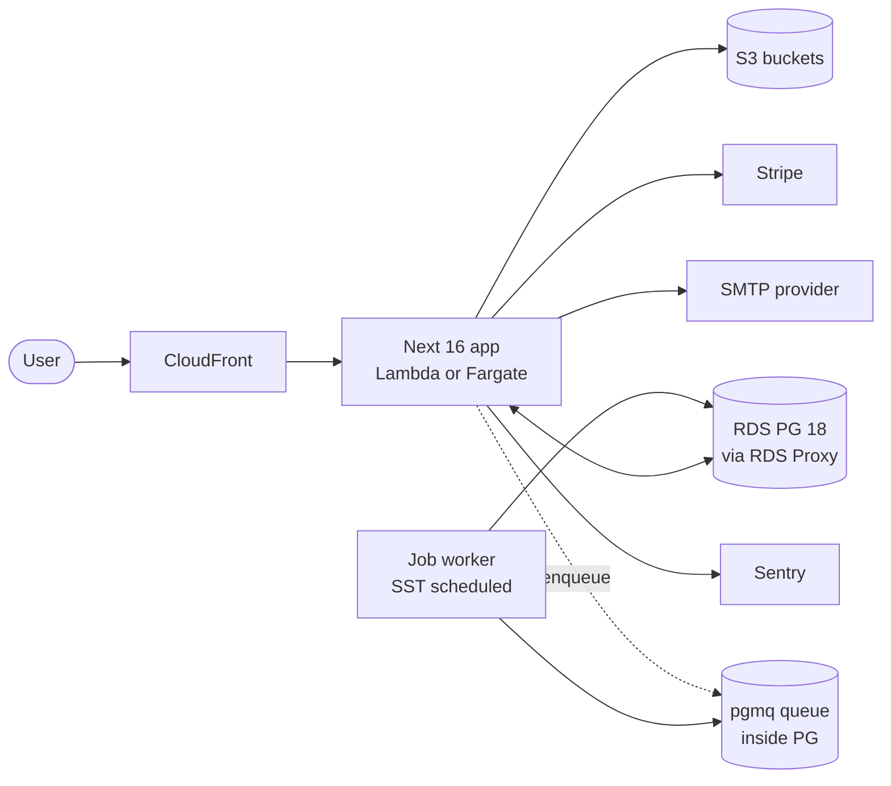

# System

> Backend + frontend architecture, data flow, deploy topology. Updated when shape changes.

## Container diagram (C4 L2)



## Frontend

- Next 16 App Router on `app.<domain>` only (marketing site external).
- React 19 RSC by default; `"use client"` for interactive leaves.
- Route groups: `(auth)/` (unauthed), `(app)/` (authed + org-context).
- State: server state via RSC + server actions; client state via React `useState`/`useReducer`. No global store day 1.
- Forms: react-hook-form + zod resolver.
- Styling: Tailwind v4 with hex tokens in `:root`; component primitives from shadcn (copy-paste, no fork).

## Backend

- Server actions for mutations (zod-validated at boundary).
- Route handlers for: auth catch-all (Better Auth), webhooks (Stripe), `/api/health`, `/api/ready`.
- Org tenancy resolved in `src/proxy.ts` (Next 16 proxy, formerly middleware) from session, set on request context, propagated to DB session via `SET LOCAL app.org_id` (see `src/server/rls.ts`).

## Data flow (server action)

```mermaid
sequenceDiagram
  participant C as Client
  participant M as proxy
  participant A as Server action
  participant W as actions wrapper
  participant DB as Postgres
  C->>M: POST + cookie
  M->>M: rate-limit + auth + org resolve
  M->>A: forward + ctx{user, org}
  A->>W: invoke
  W->>W: zod parse input
  W->>DB: BEGIN; SET LOCAL app.org_id
  W->>DB: query (RLS-enforced)
  DB-->>W: rows
  W->>DB: COMMIT
  W-->>A: result
  A-->>C: response
```

## Multi-tenancy

- Tenant key: `org_id` (= `organization.id` from Better Auth org plugin).
- Every tenant table has `org_id UUID NOT NULL` + FK + index.
- RLS enabled on every tenant table day 1.
- RLS policy reads from `current_setting('app.org_id')`.
- System tables (auth core) have no RLS.
- User-scoped tables (sessions, accounts) use user-id RLS.

See `db/schema/_TEMPLATE.ts` and [`db/README.md`](../db/README.md).

## Deploy topology

| Env | Stage | Region | DB | Web | DNS |
|---|---|---|---|---|---|
| Local | – | – | docker postgres:18 | `pnpm dev` | `localhost:3000` |
| Per-dev | `<user>` | `<aws-region>` | RDS t4g.micro | Lambda | `<user>.dev.<domain>` |
| Staging | `staging` | `<aws-region>` | RDS t4g.small | Lambda | `staging.<domain>` |
| Production | `prod` | `<aws-region>` | RDS m7g.large multi-AZ | Lambda + Fargate fallback | `app.<domain>` |

Apex `<domain>` and `www.<domain>` host the marketing site externally: not managed by this repo.

## Auth + sessions

- Better Auth with email/password + organization plugin.
- Session cookie scoped to `app.<domain>`.
- MFA enrollment in `features/auth/ui/`.
- Org switcher in `features/orgs/ui/`.

## Jobs

- pgmq queue inside PG (extension provisioned by `db/init.sql`).
- 5s tick poller deployed as SST scheduled function.
- Migration trigger to dedicated worker package: when invocation count or job latency exceeds threshold (decision recorded as ADR).

## External integrations

| Service | Purpose | Auth | Webhooks |
|---|---|---|---|
| Stripe | Billing | API key + webhook secret | `/api/webhooks/stripe` |
| SMTP provider | Transactional email | Per-mailbox SMTP creds | – |
| Sentry | Errors, perf, replay | DSN + release token | – |
| AWS | Hosting | OIDC role from GitHub Actions | – |

## Observability

- Sentry: client + server + edge configs in `src/sentry.*.config.ts`. Release tagged with git SHA.
- pino logger via `lib/logger.ts`: pretty in dev, JSON in prod. Request-bound child loggers.
- CloudWatch alarms: RDS CPU/storage, Lambda errors + p99 latency, pgmq queue depth (see `infra/monitoring.ts`).

## Tech-debt log

Add an entry only when the cost is observed (alert fired, customer asked, regression measured). Speculation belongs in `BACKLOG.md`, not here.

| Item | Cost (observed when) | Trigger to fix |
|---|---|---|
| (none yet) | – | – |
